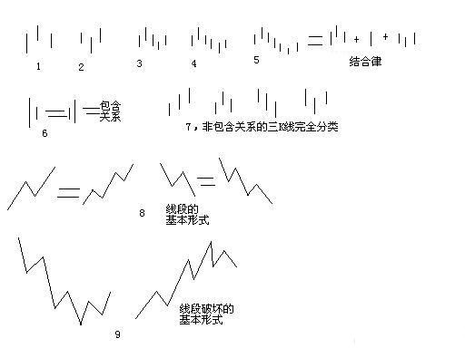

# 缠论108课
## 中枢
### 17课
缠中说禅技术分析基本原理一：任何级别的任何走势类型终要完成。

缠中说禅走势中枢：某级别走势类型中，被至少三个连续次级别走势类型所重叠的部分。

缠中说禅盘整：在任何级别的任何走势中，某完成的走势类型只包含一个缠中说禅走势中枢。

缠中说禅趋势：在任何级别的任何走势中，某完成的走势类型至少包含两个以上依次同向的缠中说禅走势中枢。该方向向上就称为上涨，向下就称为下跌。注意，趋势中的缠中说禅走势中枢之间必须绝对不存在重叠。

缠中说禅技术分析基本原理二：任何级别任何完成的走势类型，必然包含一个以上的缠中说禅走势中枢。

缠中说禅走势分解定理一：任何级别的任何走势，都可以分解成同级别“盘整”、“下跌”与“上涨”三种走势类型的连接。

缠中说禅走势分解定理二：任何级别的任何走势类型，都至少由三段以上次级别走势类型构成。

第一类买点：对于下跌的走势来说，一旦完成，只能转化为上涨与盘整，因此，一旦能把握下跌走势转化的关节点买入，就在市场中占据了一个最有利的位置。

第二类买点：因为无论是趋势还是盘整在图形上最终都要完成，所以在第一类买点出现后第一次次级别回调制造的低点，是市场中第二有利的位置，为什么？因为上涨和盘整必然要在图形上完成，而上涨和盘整在图形上的要求，是必须包含三个以上的次级别运动，因此后面必须还至少有一个向上的次级别运动。

缠中说禅买卖点定律一：任何级别的第二类买卖点都由次级别相应走势的第一类买点构成。这样，就像前面曾说过的，任何由第一、二类买卖点构成的缠中说禅买卖点，都可以归结到不同级别的第一类买卖点。

缠中说禅趋势转折定律：任何级别的上涨转折都是由某级别的第一类卖点构成的；任何的下跌转折都是由某级别的第一类买点构成的。

### 18课
缠中说禅走势中枢定理一：在趋势中，连接两个同级别“缠中说禅走势中枢”的必然是次级别以下级别的走势类型。

最低级别的缠中说禅走势中枢是跳空缺口。往往相连走势类型的级别越低，表示其力度越大，这也就是为什么缺口在分析中有比较强技术含义的理论依据所在。

“缠中说禅走势中枢定理二”：在盘整中，无论是离开还是返回“缠中说禅走势中枢”的走势类型必然是次级别以下的。

“缠中说禅走势中枢定理三”：某级别“缠中说禅走势中枢”的破坏，当且仅当一个次级别走势离开该“缠中说禅走势中枢”后，其后的次级别回抽走势不重新回到该“缠中说禅走势中枢”内。这定理三中的两个次级别走势的组合只有三种：趋势+盘整，趋势+反趋势，盘整+反趋势。

而站在实用的角度，最用力的破坏，就是：趋势+盘整。例如在上涨中，如果一个次级别走势向上突破后以一个盘整走势进行整理回抽，那其后的上涨往往比较有力，特别这种突破是在底部区间。这种情况太常见了，其理论依据就在这里。

### 20课
缠中说禅走势级别延续定理一：在更大级别缠中说禅走势中枢产生前，该级别走势类型将延续。也就是说，只能是只具有该级别缠中说禅走势中枢的盘整或趋势的延续。

现在这种最多只出现过日线走势中枢的走势，在周线走势中枢出现前，不可能结束。而且，从去年8月份开始的走势，甚至连日线的走势中枢都没形成过，最多就是30分钟的，要结束这种走势，首先要形成日线的中枢。

缠中说禅走势级别延续定理二：更大级别缠中说禅走势中枢产生，当且仅当围绕连续两个同级别缠中说禅走势中枢产生的波动区间产生重叠。

缠中说禅走势中枢中心定理一：走势中枢的延伸等价于任意区间[dn，gn]与[ZD，ZG]有重叠。换言之，若有Zn，使得dn>ZG或gn<ZD，则必然产生高级别的走势中枢或趋势及延续。

缠中说禅走势中枢中心定理二：前后同级别的两个缠中说禅走势中枢，后GG〈前DD等价于下跌及其延续；后DD〉前GG等价于上涨及其延续。后ZG<前ZD且后GG〉=前DD，或后ZD〉前ZG且后DD=<前GG，则等价于形成高级别的走势中枢。

由定理一，可以得到第三类买卖点定理：一个次级别走势类型向上离开缠中说禅走势中枢，然后以一个次级别走势类型回试，其低点不跌破ZG，则构成第三类买点；一个次级别走势类型向下离开缠中说禅走势中枢，然后以一个次级别走势类型回抽，其高点不升破ZD，则构成第三类卖点。

### 21课
缠中说禅买卖点的完备性定理：市场必然产生赢利的买卖点，只有第一、二、三类。

缠中说禅升跌完备性定理：市场中的任何向上与下跌，都必然从三类缠中说禅买卖点中的某一类开始以及结束。换言之，市场走势完全由这样的线段构成，线段的端点是某级别三类缠中说禅买卖点中的某一类。

### 15课
飞吻：当走势突破短期均线却不能突破长期均线，就会形成“飞吻”。

唇吻：当走势突破长期均线马上形成陷阱，就会形成“唇吻”。

湿吻：当走势突破长期均线出现一定的反复，就会形成“湿吻”。

缠中说禅趋势力度：前一“吻”的结束与后一“吻”开始由短线均线与长期均线相交所形成的面积。

背驰：在前后两个同向趋势中,当缠中说禅趋势力度比上一次缠中说禅趋势力度要弱，就形成“背驰”。

按这个定义，是最稳妥的办法，但唯一的缺点是必须等再次接吻后才能判断，这时候，走势离真正的转折点会已经有一点距离了。如何解决这个问题：第一种方法，看低一级别的图，从中按该种办法找出相应的转折点。这样和真正的低点基本没有太大的距离。

还有一种方法，技巧比较高，首先再定义一个概念，称为缠中说禅趋势平均力度：当下与前一“吻”的结束时短线均线与长期均线形成的面积除以时间。因为这个概念是即时的，马上就可以判断当下的缠中说禅趋势平均力度与前一次缠中说禅趋势平均力度的强弱对比，一旦这次比上次弱，就可以判断“背驰”即将形成，然后再根据短线均线与长期均线的距离，一旦延伸长度缩短，就意味着真正的低部马上形成。按这种方法，真正的转折点基本就可以完全同时地抓住。但有一个缺陷，就是风险稍微大点，且需要的技巧要高点，对市场的感觉要好点。

### 24课
缠中说禅背驰-买卖点定理：任一背驰都必然制造某级别的买卖点，任一级别的买卖点都必然源自某级别走势的背驰。

用MACD判断背驰的前提是，A、B、C段在一个大的趋势里，其中A之前已经有一个中枢，而B是这个大趋势的另一个中枢，这个中枢一般会把MACD的黄白线（也就是DIFF和DEA）回拉到0轴附近。而C段的走势类型完成时对应的MACD柱子面积（向上的看红柱子，向下看绿柱子）比A段对应的面积要小，这时候就构成标准的背弛。

注意，看MACD柱子的面积不需要全出来，一般柱子伸长的力度变慢时，把已经出现的面积乘2，就可以当成是该段的面积。

### 62课

顶分型：像图1这种，第二K线高点是相邻三K线高点中最高的，而低点也是相邻三K线低点中最高的。

底分型：像图2这种，第二K线低点是相邻三K线低点中最低的，而高点也是相邻三K线高点中最低的。

顶、底：顶分型的最高点叫该分型的顶，底分型的最低点叫该分型的底，由于顶分型的底和底分型的顶是没有意义的，所以顶分型的顶和底分型的底就可以简称为顶和低。也就是说，当我们以后说顶和底时，就分别是说顶分型的顶和底分型的底。

笔：两个相邻的顶和底之间构成一笔，所谓笔。在实际分析中，都必须要求顶和底之间都至少有一K线当成一笔的最基本要求。

线段：而所谓的线段，就是至少由三笔组成。
